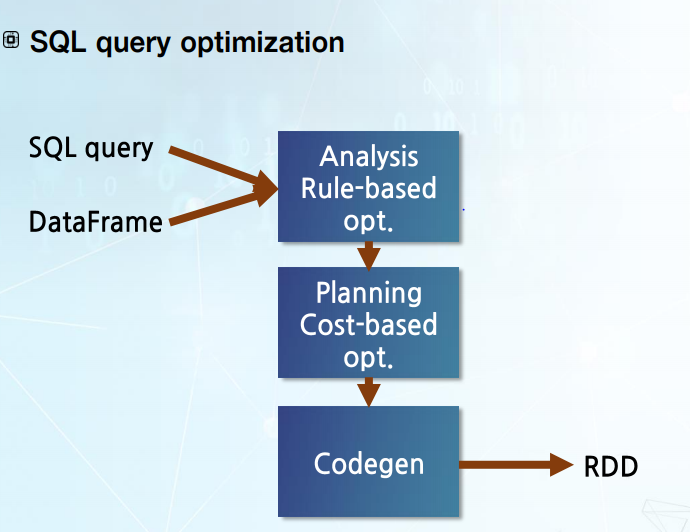
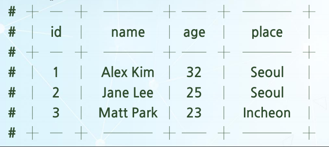
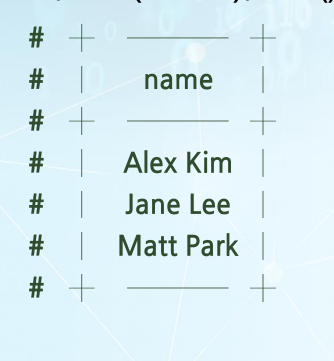
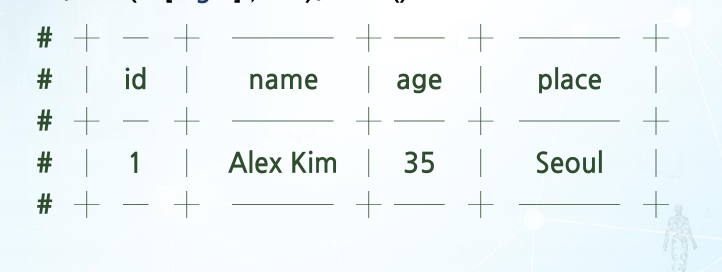
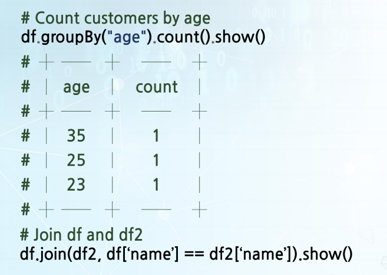

# 대화형 질의 방법

데이터가 구조화된 데이터일 경우에 사용되는 방법

대표적인 대화형 질의 언어

* SQL(Structured Query Language)라는 언어가 있습니다. 이 언어는 구조화된 데이터의 질의를 표현하는 데 최적화된 언어입니다.
  특히나 SQL은 데이터가 관계형 모델로 표현됐을 때 사용하는 도메인 특화된 언어입니다.
  * 구조화된 데이터란 과연 어떻게 표현된 데이터일까요? 보통 구조화된 데이터를 얘기할 때 데이터가 테이블 형태로 구성된 데이터라고 합니다.
    테이블은 여러 개의 row와 여러 개의 column으로 구성되어 있습니다.

4

| ID   | Name      | Age  | Place   |
| ---- | --------- | ---- | ------- |
| 1    | Alex kim  | 32   | Seoul   |
| 2    | Jane Lee  | 25   | Seoul   |
| 3    | Matt Park | 23   | Incheon |


## operation

1. Projection

   - 테이블에서 어떤 column만 뽑아서 보고 싶다고 할 때 사용하는 operation
     아래에서 customer 테이블에서 Name과 Age column만 뽑아서 보고 싶다는 Projection을 하면

     - | Name      | Age  |
       | --------- | ---- |
       | Alex kim  | 32   |
       | Jane Lee  | 25   |
       | Matt Park | 23   |

     

2. Selection

   - 특정 조건을 만족하는 row들만 뽑아서 그 결과를 보여주는 것

   - customer 테이블에서 나이가 30 초과한 row만 보고 싶다고 하면

     - |      |          |      |       |
       | ---- | -------- | ---- | ----- |
       | 1    | Alex kim | 32   | Seoul |

     

3. Aggregation

   - 하나의 column에 대해서 데이터 통계를 내서 보고 싶을 때 사용

   - 예를 들면 customer 테이블에서 각각 Place 값이 얼마나 나타났는지 알고 싶습니다. 그 경우 그러한 Aggregation operation을 하면 아래 테이블과 같이 결과가 나옵니다.
     Place가 Seoul인 경우는 두 번 나왔고, Place가 Incheon인 경우에는 한 번 나왔기 때문에 각각 두 번, 한 번으로 결과가 나옵니다.

     | Place   | Count |
     | ------- | ----- |
     | Seoul   | 2     |
     | Incheon | 1     |

     

4. Join

   - 두 개의 테이블에 있는 데이터를 같이 보고 싶을 때 사용

   - 두 개의 테이블이 공통적인 이름을 갖는 column들이 있을 때 그 해당하는 column의 값이 같은 row들을 찾아서 병합하는 방법
     Join에는 여러 가지 방법이 있습니다. 

     1. Natural Join은 각 두 테이블에 해당하는 column의 값이 다 존재해야 합니다.
     2. Left outer Join에는 Left 쪽 테이블에 해당하는 column의 값이 있어야 합니다.
     3.  Right outer Join에는 오른쪽 테이블에 해당하는 column의 값이 있어야 합니다.

     예로 두 개 테이블의 Natural Join 예제를 보겠습니다. Natural Join 예제를 위해서 하나의 테이블을 더 소개하겠습니다.

     * Customer Table

       | ID   | Name      | Age  | Place   |
       | ---- | --------- | ---- | ------- |
       | 1    | Alex kim  | 32   | Seoul   |
       | 2    | Jane Lee  | 25   | Seoul   |
       | 3    | Matt Park | 23   | Incheon |

       

     * Department Table

       | Place   | Lead  |
       | ------- | ----- |
       | Seoul   | Bob   |
       | Incheon | Alice |

       

     * Join

       | 1    | Alex kim | 32   | Seoul | Bob  |
       | ---- | -------- | ---- | ----- | ---- |
       | 2    | Jane Lee | 25   | Seoul | Bob  |


## Spark SQL

이러한 SQL 형태의 분석 방법을 사용해서 대규모 데이터를 분석하기 위해서는 Spark의 대화형 질의 방법인 SparkSQL을 사용할 수 있습니다.

## DataFrame

* Spark에서 대화형 질의를 표현하는 중요한 기능 중에 하나가 DataFrame
* DataFrame은 데이터베이스에서의 테이블 또는 R이나 Python, Pandas 사용되는 DataFrame 개념과 유사
* 데이터가 여러 row로 구성돼 있고 각 row는 이름을 가진 column 값을 가지고 있음
* DataFrame은 관계형 operation을 지원
*  실제로 Spark에서 SQL 질의를 수행하려고 하면, 해당하는 SQL 질의를 Spark가 이행하는 RDD 변환으로 바꿔서 수행
* Spark stack에서 Spark Core 위에 다양한 분석을 하는 라이브러리가 올라가 있음. 
* 그 라이브러리 중에 하나가 SparkSQL
* 
  1.  SQL 최적화 과정이 일어나게 됩니다. 
     * 입력으로 SQL 질의와 데이터에 해당하는 DataFrame이 들어갑니다.
     * 그러면 분석 과정을 통해서 최적화된 논리 계획이 나옵니다. 이 분석 과정에서는 룰에 기반한 최적화를 하게 됩니다.
  2. 최적화된 논리 계획이 다음 단계로 물리 계획을 만들어내는 Planning 단계로 들어갑니다. 
     - 이 Planning 단계에서는 Cost 기반의 최적화를 하게 됩니다.
  3. 그렇게 해서 나온 SQL 질의 물리 계획은 Codegen이라는 부분에 들어가서 
  4. 최종적으로 Spark가 수행할 수 있는 RDD 변환 형태로 바뀌게 됩니다.

## SPARKSQL API

### Creating DataFrames

```python
# Read customer data and create ad DataFrame
df = spark.read.json("data/custormer.json") #customer.json이라는 데이터를 읽어서 DataFrame을 만드는 방법
# 여기에서 만들어진 DataFrame을 df라고 표현

# Displays the content of the DataFrmme to stdout
df.show() #  DataFrame에 어떤 데이터가 있는지 보고 싶은 경우, df.show를 하면 DataFrame 내부 정보 중에 일정 부분을 택해서 standard out으로 보여줌
```



```python
# Print the schema in a tree format
df.printSchema() #해당하는 DataFrame의 Schema가 어떤 형태로 되어 있는지 보고 싶으면, df.printSchema를 하면 됩니다.
```


### Basic DataFrame Operations

1. Select

   - 특정 필드와 또는 특정 필드에 함수를 적용한 값을 보여주는 operation

   - ```python
     df.select("name").show()
     ```

   - 

2. filter

   -  row들 중에 특정 조건을 만족하는 row만 선택해서 보여주는 것

   - ```python
     df.filter(df['age']>30).show()
     ```

   - 

3. groupBy

   - 어떤 column에 대해서 해당하는 column 값이 같은 row들을 모은 다음에 그 후에 Aggregation 함수를 적용

     ```python
     df.groupBy("age").count().show()
     ```

     


