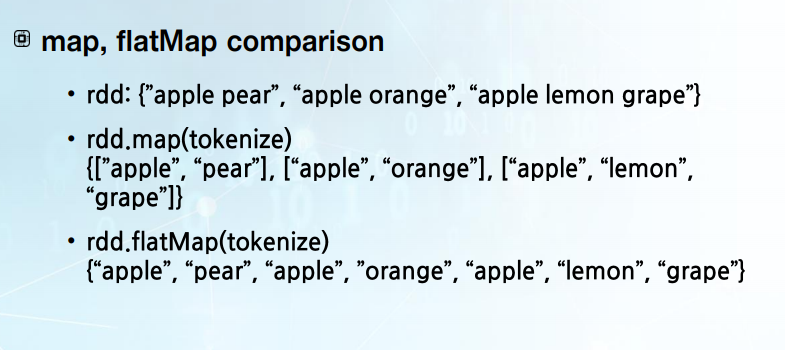

# 3주차 배치분석

이번 시간에는 빅데이터 분석 방법 중 많은 데이터가 저장되어 있을 때 수행하는 Batch 분석에 대해서 살펴보겠습니다.
Batch 분석은 많은 데이터를 큰 단위로 분석하는 분석 방법입니다. 예를 들면 데이터 전처리를 위한 ETL이 Batch 분석 중에 하나입니다.

## RDD 생성방법

1.  병렬화된 collection
   * python이나,java 등등 해당하는 언어를 RDD에 병렬 coleection으로 바꾸는 함수 사용 

이런 Batch 분석은 Spark의 RDD operation을 통해서 표현할 수가 있습니다.
Spark의 RDD operation를 통해서 프로그램을 구성하려고 하면 다음과 같은 단계들을 거쳐야 합니다.
맨 먼저 RDD를 생성하는 단계가 있습니다. 크게 두 가지 방법이 있습니다. 첫 번째로 병렬화된 collection을 만드는 방법입니다.
예로 기존에 collection이 Python 프로그램이나 Java 프로그램, 해당하는 언어로 존재한다고 하면 그 언어를 RDD에 병렬 collection으로 바꾸는 함수가 있습니다.
Parallelize(existingCollection)을 하면 해당하는 collection이 RDD 형태로 변형이 됩니다.

이 함수는 많은 경우에 테스트를 위해 작은 데이터를 분산화시켜서 사용하고자 할 때 사용하는 경우가 많습니다.
실제로 아주 큰 데이터를 분산 파일 시스템에 저장하고 있을 때는 두 번째 방법과 같이 RDD를 만듭니다.
예로 Hadoop 분산 파일 시스템에 데이터를 가지고 있는 경우, 해당하는 데이터 파일들의 위치를 textFile이라는 함수에 주면 데이터를 읽어서 RDD를 생성하게 됩니다.
이렇게 RDD를 만든 후에 다양한 변환을 수행할 수가 있습니다.

## RDD 변환 

Element-wise 변환

- RDD 에 들어가 있는 각각의 원소마다 특정 변환을 하는 방법
  1. Map
     - RDD에 있는 각각의 원소에 Map에 남겨진 함수를 적요아ㅐ서 결과를 만들어내고, 그 겨로가들을 모아서 RDD를 만들어냄
  2. flatMap
     - RDD에 있는 각각의 원소에 flatMap에 넘겨진 함수를 적용하고,  그 함수 결과로 나오는 iterator에 각각의 element를 다 꺼내서 flat된 RDD를 만들어냄
  3. filter
     - RDD에 포함된 element 중에 filter 안에 표현된 조건을 만족하는 원소만 통과를 시켜서 모은 RDD를 반환하게 됨

### 예시



## Pair RDD

* RDD에 포함된 element가 key/value pair 형태로 되어 있는 경우
* Pair RDD에 대해서는 각 key에 대해서 병렬로 수행할 수 있는 operation을 보여주거나 아니면 네트워크에서 특정 key에 해당하는 데이터를 모으는 operation을 더 보여줍니다.
* 대표적인 operation으로 reduceByKey와 join이 있습니다. reduceByKey는 각각의 키에 대해서 데이터를 모으는 과정을 하고, 그 모인 데이터에 대해서 reduce 함수를 적용합니다.
  join의 경우에는 두 개의 RDD가 있을 때 적용하는 operation입니다. RDD 2개에 같은 key를 갖는 element들을 모아 grouping해서 하나의 결과로 만드는 것이 join이 되겠습니다.

## Pair RDD 변환

| Transformation | Description                                                  |
| -------------- | ------------------------------------------------------------ |
| reduceByKey    | 같은 키를 갖는 값들을 결합하는 것                            |
| groupByKey()   | 같은 키를 갖는 값들을 모으는 것                              |
| keys()         | key만 모아서 RDD를 만들고 return                             |
| values()       | value에 해당하는 부분만 모아서 RDD를 만들고 return           |
| sortBykey()    | key에 대해서 값을 sorting한 후 만들어진 RDD를 return         |
| join()         | 두 개의 RDD 사이에 join이라는 기능을 수행한 후 결과를 돌려주는 것 |


## Action

- Spark가 결과를 만들어내도록 계산을 trigger 하는 operation입니다.

많은 Action 중에 다음과 같은 Action을 살펴보겠습니다. 첫 번

| Transformation           | Description                                                  |
| ------------------------ | ------------------------------------------------------------ |
| collect()                | master에 해당하는 드라이버 프로그램에 결과로 돌려주는 Action |
| count()                  | RDD 데이터 셋에 얼마나 많은 원소가 있는지 세어서 그 결과를 돌려주는 Action |
| first()                  | RDD 데이터에서 첫 번째 원소를 반환하는 Action                |
| take(n)                  | RDD 데이터에서 처음 n개 원소를 반환하는 Action               |
| saveAsTextFile(path)     | 주어진 path에 RDD 데이터를 저장하는 Action                   |
| saveAsSequenceFile(path) | RDD 중에 Pair 형태로 표현된 Pair RDD 데이터를 SequenceFile 형태로 저장하는 Action |

### Persistence

Spark 프로그램을 짤 때 In-memory computing을 활용하기 위해서 프로그램 상에서 해줄 수 있는 것이 Persistence입니다.

- rdd.persist : 계산한 결과를 메모리에 유지하고 싶다는 것을 표현할 때 사용
-  RDD를 다시 계산하는 것이 아니라, 이미 저장되어 있는 RDD를 사용하게 됩니다.
- 각각의 load는 많은 경우에 RDD의 특정 파티션에 해당하는 부분을 메모리에 저장하고 그리고 그 후에 저장된 RDD 부분을 사용하게 됩니다.
- RDD의 특정 부분이 손실된 경우, lineage라는 걸 통해서 자동적으로 재계산을 하게 됩니다.

### 예제

예제로 설명 드릴 것은 다양한 시스템 log가 모여 있을 때 해당하는 log를 mining 하는 Log Mining

```python
lines = sc.textFile("hdfs://data/logs")

errors = lines.filter(lambda line: line.startsWith("ERROR"))

messages = errors.map(lambda line:line.split()).map(lambda words:words[1])

messages.filter(lambda line:"sshd" in line).count()

messages.filter(lambda line:"ngnix" in line).count()
```


```python
lines = sc.textFile("hdfs://data/logs")
```

*  log 파일을 읽어서 lines라는 RDD를 만들어내는 과정

* lines RDD를 만든 후에 많은 line 중에서 특히나 ERROR가 발생한 것을 logging한 line에 관심 있다고 하면, line 중에 ERROR로 시작하는 line만 추출하라는 filter 변환을 하게 됩니다.

* ```python
  errors = lines.filter(lambda line: line.startsWith("ERROR"))
  
  ```

* 그 변환으로 나온 결과가 errors RDD가 되겠습니다.

* 해당하는 ERROR line들 중에 그 후에 하는 것이 map을 통해서 변환하는 것을 합니다.

* ```python
  messages = errors.map(lambda line:line.split()).map(lambda words:words[1])
  ```

* 먼저 첫 번째 map 변환을 통해서 해당하는 line을 split해서 여러 개 word의 리스트로 바꿉니다.

* 두 번째 map 변환을 통해서는 여러 word 중에 index1에 해당하는 string을 꺼내는 것을 합니다. 

* 그렇게 해서 나온 RDD를 messages라고 부르겠습니다.

* ```python
  messages.filter(lambda line:"sshd" in line).count()
  
  messages.filter(lambda line:"ngnix" in line).count()
  ```

* 그다음에 하는 변환은 이렇게 나온 ERROR 관련된 messages 중에 관심 있는 것이 secure shell daemon과 관련된 것이라고 하면,
  해당하는 messages에 sshd가 포함되어 있는지, 그렇게 포함되어 있는 messages로 추출하라는 filter 변환을 하게 됩니다.
  그렇게 변환된 결과를 가지고 최종적으로 얼마나 그렇게 많은 messages가 있는지 보고 싶다고 하면, count라는 Action을 하게 됩니다.

* 그러면 결과로 ERROR messages 중에 sshd와 관련된 messages가 몇 개 있다는 결과가 나오게 됩니다.

* 그런데 로그 분석 중에 sshd 관련된 ERROR뿐만 아니라 웹 서버와 관련된 ngnix가 들어가 있는 messages도 관심이 있다고 생각해봅시다.
  그러면 이미 ERROR가 포함된 ERROR 관련된 것을 계산하는 RDD가 messages로 있으니까 그 messages에 ngnix가 들어가 있는 line만 선택해서,
  그런 messages만 선택해서 추출하라고 명령을 하면 ngnix 관련된 ERROR messages로 추출하게 됩니다.
  그리고 최종적으로 그런 messages가 얼마나 많은지 알고 싶다고 하면 count라는 것을 부르면 됩니다.
  이런 Log Mining Example을 통해서 다양한 로그 분석을 할 수가 있습니다.

여기서 한 가지 짚고 넘어가야 될 것은 첫 번째, messages.filter.count를 했을 때, 즉 첫 번째 count Action이 있을 때 기존에 위에서 정의된 Transformation들이 수행이 된다는 것입니다.
즉, count라는 결과를 얻기 위해서는 lines를 만들어내야 되고, lines에서 errors를 만들어내야 되고, errors에서 messages를 만들어내고, 최종적으로 sshd가 들어간 messages를 만들어내야 합니다.
그다음에 또 messages.filter ‘ngnix’ 관련된 추출을 하고 count 하는 것을 수행하겠다고 하면, 이 count 결과를 얻기 위해서 해당하는 과정들이 반복이 됩니다.
즉, count 결과를 얻기 위해서는 lines라는 걸 만들어내고, errors라는 걸 만들어내고, messages라는 걸 만들어내고, messages 중에서 ngnix가 들어간 것들을 추출하는 것을 수행하게 됩니다.
그런데 가만히 살펴보면 messages라는 것을 count라는 Action을 두 번 수행할 때 각각 두 번 계산하는 것을 볼 수가 있습니다. 이것은 상당히 비효율적으로 보입니다.
messages가 여러 번 사용하게 된다면 계산을 한 후에 계산된 결과를 저장하는 것이 좋겠습니다. 그것을 가능하게 하는 것이 Spark의 RDD Persistence입니다.
messages라는 RDD를 만들고 그 계산된 결과를 저장하라고 선언하면, persist하라고 선언하면 계산된 messages는 메모리 상에 저장됩니다.
이 프로그램의 경우에는 첫 번째 count를 수행할 때는 lines RDD를 만들고, errors RDD를 만들고, messages RDD를 만들고,
해당하는 messages을 메모리에 저장하고, 그리고 messages에서 sshd가 들어간 messages로 추출하는 것을 한 후에 count를 하게 됩니다.
그 후에 두 번째 count에서는 messages라는 것이 이미 메모리에 저장되어 있기 때문에 앞에 lines, errors, messages을 만드는 과정이 생략되고
바로 messages로부터 ngnix가 들어가 있는 messages를 추출하는 것을 하고, 그 추출된 messages가 몇 개인지 계산하는 것을 바로 수행하게 됩니다.
그러므로 중복적으로 lines, errors, messages를 만드는 RDD 변환을 하지 않게 됩니다.
